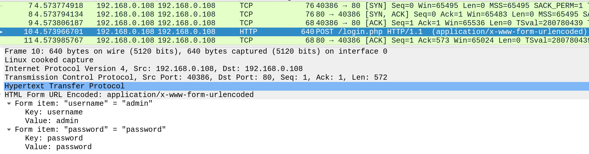
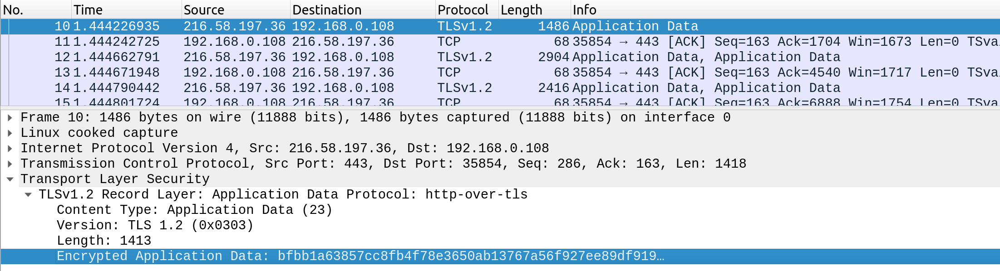
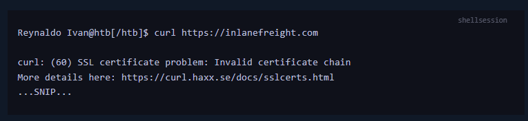
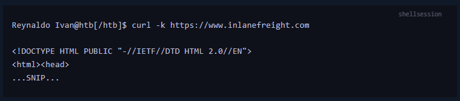

En un inicio, las comunicaciones en internet se hacia a través del protocolo HTTP, pero este protocolo tenia una grave problema, que trasmitía los datos sin cifrar, lo que significaba que un ciberdelincuente podía posicionarse en el medio y empezar a capturar todos los paquetes que se estén transmitiendo entre el cliente y el servidor. Este ataque se le conoce como ataque de *Hombre en el medio*.
A raíz de eso se decidió crear al protocolo HTTPs (HTTP Secure) que es la versión segura del protocolo HTTP, mantiene el mismo flujo y estructura en la comunicación entre el cliente y servidor pero este nuevo protocolo integra un certificado de cifrado que hace que las comunicaciones estén cifradas de un punto al otro mitigando el ataque antes mencionado, lo que dio lugar a que los navegadores ya no permitan a los usuarios visitar sitios HTTP por riesgo a la intercepción y robo de los datos y convirtiendo en un estándar al protocolo HTTPS.

---
## Descripción General del protocolo HTTPs

Si nosotros tratamos  de iniciar sesión en algún sitio web que tiene implementado el protocolo HTTP, nuestras credenciales quedaran expuestas como se muestra en la imagen, pues al no estar cifrada la comunicación entre el cliente y el servidor, los datos viajan en texto plano. Lo puede generar que nos roben las credenciales e inicien una sesión no autorizada.

Por el contrario, cuando nosotros iniciemos sesión en algún sitio web que tenga implementado el protocolo HTTPS, el ciberdelincuente se llevara la sorpresa de que los datos están cifrados, gracias a que se utiliza un certificado valido de cifrado, haciendo dificil la tarea de que nos roben las credenciales.

La forma tenemos para reconocer sitios que tengan implementado el protocolo HTTPs, es dirigiéndonos en la URL, donde encontraremos ``https://`` y ademas mostrara __el incono de un candado verde__, asegurándonos de que el sitio es confiable y que los datos están protegidos.

- _Nota: Debes de tomar en cuenta a que servidor DNS te estas conectando, porque si está comprometido, a pesar de que tus datos estén cifrados, el servidor podrá registrar que URL te estas conectando, por ello utiliza los DNS de proveedores confiables o un servicio VPN.

--- 

## Flujo HTTPs

Bueno ahora explicaremos el proceso de comunicacion del protocolo HTTPS.

1. En primer lugar el cliente (navegador/aplicacion) envia un REQUESTS con el metodo GET para conectarse por el puerto 80 utilizando el protocolo HTTP.
2. El servidor WEB detecta esto y regresa un  RESPONSE redirigiendo la peticion del cliente al protocolo HTTPS  por el puerto 443  a través del codigo de estado ___301 Moded Permanently__.
3. El cliente nuevamente envia una peticion GET pero ahora por el puerto 443, adicionalmente envia un paquete *__Client Hello__* con información adicional para el servidor.
4. El servidor recibe la solicitud del cliente, y le devuelve una paquete *__Server Hello__* con informacion adicional para el navegador, añadiéndole el certificado de cifrado propio del servidor.
5. El cliente recibe la información y verifica que el certificado de cifrado enviado por el servidor sea verídico, en caso de que lo sea, le envia su propio certificado de cifrado, iniciando la comunicacion por el cliente.
6. El servidor recibe la solicitud y tambien inicia una comuncacion cifrada, dando lugar a que los datos esten cifrados.
7. Los que sigue es una comunicacion HTTP normal con la diferencia de que ahora los datos estan cifrados.

--- 
## cURL para HTTPS

Al utilizar ``curl``,  este gestiona de manera automática las peticiones hacia un sitio web con protocolo HTTPS, asegurando de que surja una comunicación cifrada y que los datos no queden expuestos, trabaja de la misma manera que lo haria un navegador.

Pero exiten casos donde deberos probar aplicacion web en local o que no tengan un certificado ssl no valido, y cuando surja eso, __curl__ nos devolvera un mensaje de error negándonos la conexion para protegernos del ataque de ``hombre en el medio`` por intentar una comunicacion no cifrada hacia un sitio que no tiene un certificado ssl no valido.

En estos caso podemos utilizar la opcion __-k__ , por no tener un certificado ssl valido.

``curl -k https://www.inlanefreight.com ``

