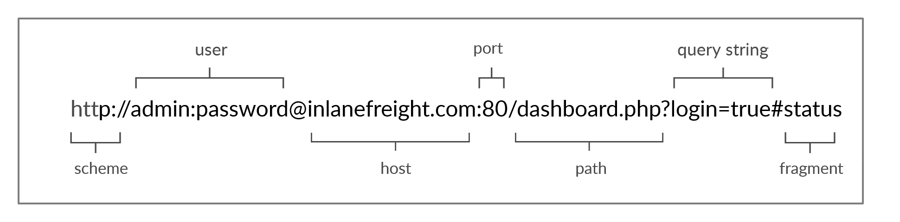
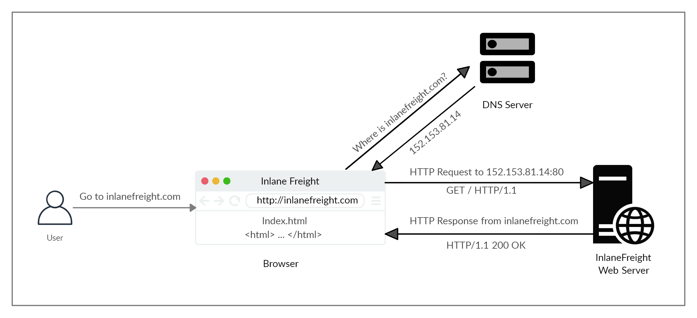
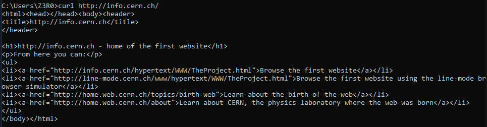
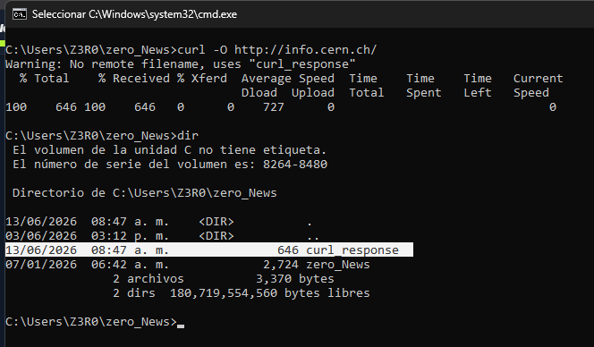
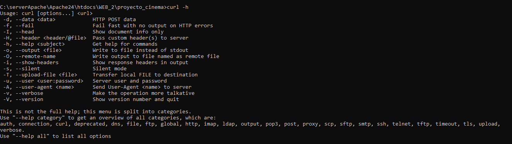

Las comunicaciones en internet se reslizan a travéz de solicitudes web, pues cuando una aplicación móvil o web requiere de algún recurso hace uso de una solicitud, pero para lograrlo se tiene que utilizar del protocolo [HTTP](https://datatracker.ietf.org/doc/html/rfc2616). Se le dice hipertexto porque el usuario puede acceder a otros recursos a través de enlaces. 

La estructura en una comunicación HTTP es a través de un cliente y un servidor, donde el cliente envía diferentes solicitudes al servidor que son recibidas y procesadas para después ser devueltas al cliente, el puerto donde da lugar esta comunicación, es en el puerto 80, pero claro que puede cambiar a otro puerto diferente, Aquí también da lugar un concepto nuevo que es la URL (Localizador Uniforme de Recursos)

- Dicho de otra manera, el protocolo HTTP se utiliza para lograr la transferencia de archivos de un punto a otro (cliente-servidor) a travez de internet.
---
## URL

Para poder acceder aun recurso de web, los hacemos a través de una URL, pues todo cuanto esta en la web, tiene una URL.

 

Una URL lo forman los siguientes componentes:

* Sheme:    __https:__ que es quivalente al protocolo que esta utlizando en ese momento, y en la mayoria de los casos son dos, HTTP y HTTPs, Aunque claro tambien pueden utilizarse otros protocolos.
* User Info: __admin:password__ en algunos casos las URL te pediran que ingreses un usuario y una contraseña, pero en la mayoria de los casos no es asi.
* Host __inlanefreight.com__ Representa al dominio de la empresa, es decir, el como aparece en internet.
* Port __80__ Es la direccion donde se da lugar las comunicaciones entre dieferentes nodos de la red.
* Path: __/dasboard.php__ es el recurso a la cual nosotros estamos accediendo y visualizaremos en nuestro navegador.
* Query Sring __?login=true__ Esto se puede representar como una consulta que se tranmiste a traves de las URL
* Frgments __ status__ los navegadores utilizan los fagmentos del lado de cliente para localizar ciertos recurcursos.

Los componentes mas importantes de la imagen son el protocolo y el hosts, pues sin ellos, la URL seria invalida, los demás son complementos que se adaptan a los diferentes escenarios.

---
## Flujo HTTP

Cuando nosotros navegamos por internet y accedemos a una pagina como facebook.com, se logra gracias al DNS (Sistema de Nombres de Dominio), que se encarga de buscar la dirección IP perteneciente a ese Dominio y devolvérselo al usuario para así acceder a la pagina, en dado caso de que no lo encuentre, buscara en otros sistemas DNS.

Pero antes de hacer esto, buscara de manera local en nuestra maquina, en el archivo 
* Linux: __/etc/hosts__
* Windows __C:\Windows\System32\drivers\etc\hosts__
En este archivo nosotros podemos añadir sitios __añadiendo la direccion IP seguido del nombre de dominio__.

Bueno cuando el navegador al fin tiene la direccion IP del dominio se da el siguiente flujo de comunicación:

1. El cliente Mandara una petición GET (Solictud web) al servidor web solicitando un archivo llamado index.html o index.php que es el archivo principal del sitio.
2. El servidor Web recibira la petición del navegador, procesara la petición y devolverá como respuesta el archivo que el usuario estaba solicitando.
	* Al devolver el archivo como respuesta, el servidor también devuelve un __codigo de estado__ (200 ok) que le indica al navegador que la solicitud fue procesada correctamente.
3. El cliente recibe la petición del usuario y renderiza el archivo index.html para que el usuario pueda visualizar el contenido en su navegador.

---
## cURL

[cURL](https://curl.se/) es una herramienta de linea de comando con la que podremos hacer  peticiones HTTP, adema tiene integrado una gran biblioteca para hacer peticiones con diferentes protocolos.

En la imagen utilizaremos la pagina `` http://info.cern.ch/ `` que fue creada por Tim Bernes Lee en el año de 1990 y puesta al publico en el año de 1991.

Para poder hacer una petición utilizando la herramienta cURL, sera de la siguiente manera:

``curl http://info.cern.ch/``

Cuando visualizamos el resultado de la peticion, notaremos que nos devolvera el codigo fuente de la pagina web, pues este no renderiza como lo haria un navegador, pero aqui lo que mas nos importa es el flujo de la __solitud-respuesta (requests-response)__ pues a partir de eso nosotros obtendremos información para vulnerar el sitio.

Ahora podemos utilizar la siguientes opciones con cURL:
* -O nos nos descargara el archivo index.php con el nombre que fue subido al sistema
* -o Nos descara el archivo con el nombre que nosotros le especifiquemos.

``curl -O http://info.cern.ch/``

Tambien podemos utillizar el parametro __-s__ que hara que los mensajes que arroje la herramienta curl mientras realice la peticion ya no se muestren por consola.

``curl -O -s http://info.cern.ch/``

Ademas si queremos visualizar todas las opciones que tiene la herramienta __curl__ podemos hacerlo con __-h__

``curl -h``

Y si queremos visualizar las opciones pero de manera mas detallada podemos ocupar __--help all__

``curl --help all``

o si queremos ver que opciones tenemos con algun protocolo en especifico, podemos hacer los suguiente:

``curl -h ftp``
``curl -h proxy``

o si  queremos leer todo el manual de la herramienta podemos hacer ``man curl``