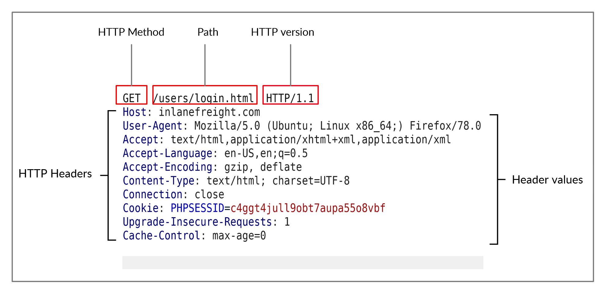
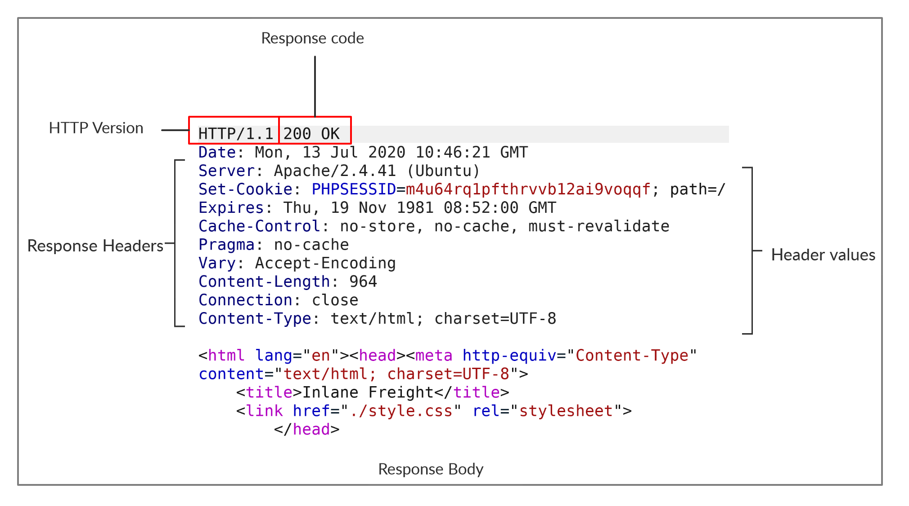
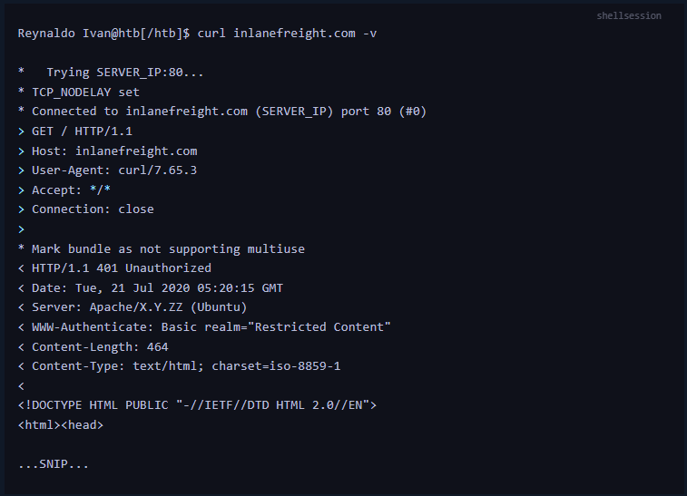

Cuando surge una comunicación entre el cliente y el servidor, se da a través de una solicitud HTTP y una respuesta HTTP (__requests y response__), donde el cliente puede ser un navegador, una aplicación móvil, un script hecho en python para interactuar con un sitio web o incluso una herramienta como cURL, que envia una solicitud HTTP al servidor, el servidor puede ser un servidor Web como apache.

El servidor por su parte, recibe esta solicitud del cliente para procesarla y ejecutar las acciones que están descritas en dicha solicitud para después regresarle una respuesta por parte del servidor al cliente, es esta respuesta aparece un codigo de estado describiendo si la solicitud fue procesada con exito o si hubo algún error.

--- 
## HTTP requests

Analizando la imagen tenemos unos puntos importantes:

* En la primera tenemos: 
	* EL METODO HTTP (GET,POST, PUT, DELETE), 
	* LA RUTA  DEL ARCHIVO ( para obtener el archivo index.html o otro archivo)
	* LA VERSION DE HTTP (es la versión en la que se comunican el cliente y el servidor y puede ser la 1.0, 1.1, aunque ya exiten la versiones 2 y 3)

Es una estructura que aparecerá en cualquier __requests HTTP__.

Esta es una de las líneas mas importantes, y es en la que nosotros interactuamos cuando hacemos hacking de aplicaciones web, pues con la aplicación de BurpSuite interceptaremos peticiones para cambiarlo de acuerdo con las necesidades de la practica.

En la segunda linea tenemos:

* los encabezados de la pagina web, es la información adicional que el servidor utiliza para procesar la información del cliente.
* Esta información tiene una estructura de __clave-valor__ donde los valores mas importantes son:
	* __HOST__: que define el dominio a donde nos vamos a conectar
	* __User-Agent__: Funciona como una carta de presentación de tu dispositivo al servidor
	* __Cookie__: es el encargado de recordar tu sesión en el sitio web para que no tengas de renviar datos.

Siendo mas descriptivos, en la imagen se muestra una solicitud hacia el dominio:

-  ``http://inlanefreight.com/users/login.html``

En el cuerpo de la solicitud puede haber información como los datos de inicio de sesión que será enviada al servidor.

*NOTA: La version 1.1 de http envia los datos en texto sin cifrar y la version 2 y 3 envia los datos en formato binario*

---
## HTTP Response

Bien por parte de la respuesta podremos observar que esta estructurado de la siguiente manera

En la primera linea tenemos:
- VERSION HTTP: HTTP/1.1
- CODIGO DE ESTADO: 200 OK

El codigo de estado representa el estado de la solicitud, si la solicitud fue procesada con exito, dara un 200 OK o un codigo 404 not found representa un error en la solicitud.

- Ademas tenemos información como el __Server__, __Conten-Type__, etc que representa informacion complementaria enviada por el servidor al cliente. Asi como lo vimos en la solicitud.

En la segunda linea tenemos los encabezados de la respuesta o conocidos como los __response Headers__, que es informacion adiciona que le servidor le envia al cliente

En la segunda linea *___que representa el cuerpo de la solicitud__* podemos tener:
- El contenido HTML de una pagina web
- Contenido JSON
- Un recurso alojado en la web
- Una imagen
- Un documento PDF

La solicitudes y la respuesta comparten una característica, que ambos tiene el encabezado con información complementaria, pero la respuesta adjunta información en el cuerpo de la respuesta, que fue solicitada por el cliente.

En otras palabras la repuesta es lo que el servidor le va a regresar al usuario, de acuerdo a lo que el usuario le haya solicitado.

--- 
## cURL

Regresando con la herramienta curl, tenemos la opcion ``-v (verbose)`` para poder visualizar todo el proceso de la solicitud HTTP y la respuesta HTTP hacia una pagina web, cosa que nos viene bien cuando estamos haciendo un hacking de aplicaciones web, porque nos da informacion detallada sobre como esta conformado la estructura del servidor web.

- ``curl -v inlanefreight.com``

Ejecutando el comando podremos obtener informacion sobre el servidor, como la version del SO y a partir de eso investigar si tiene alguna vulnerabilidad conocida y en caso de que el administrador no implemente buenas practicas de seguridad, poder comprometer todo el sistema, ademas ver el tipo de contenido que acepta el servidor entre otras cosas.

Con la opciones ``-vvv`` podemos obtener una respuesta aun mas detallada sobre el proceso de la comunicación entre el cliente y el servidor.

- ``curl -vvv inlanefreight.com``

--- 
## Browser DevTools

Como hacker profesionales debemos ser capaces de dominar diferentes herramientas para las evaluaciones de aplicaciones web, de las cuales se encuentra el navegador, pues en ella se encuentra un apartado llamado __herramienta para desarrolladores__ con las que podremos interactuar con la aplicacion web.

Ahora, cuando nosotros interactuamos con una aplicacion web, se envia multiples solicitudes HTTP y respuestas HTTP para poder visualizar el contenido de la pagina, lo que puede incluir:
- scripts en js
- hojas de estilo
- imagenes
- videos

Y con esta herramienta del navegador, podremos visualizar todas estas peticiones y repuestas.

En dicha herramienta habra diferentes secciones que tienen una funcion en especifico, pero a nosotros nos interesa el apartado de __NETWOK__, donde podremos ver todo el fujo de comunicación entre el cliente y el servidor.

Para poder cargar esta herramienta en Chrome o Firefox podremo pulsar:
- ``CTRL + MAYUS + I`` o ``F12``

Una de las opciones que tiene la herramienta es que  podremos filtrar entre diferentes peticiones (GET, POST, PUT, DELETE), o entre documentos solicitados, como una imagen, pdf, styles.css, etc. 