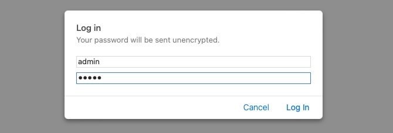
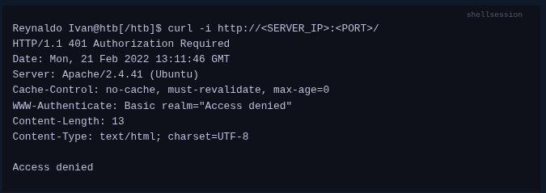

Cuando nosotros queremos acceder a un recurso web, nuestro navegador envia una peticion con el metodo GET, una vez que podemos visualizar el recurso en nuestro navegador podemos utilizar diferentes metodos HTTP segun se necesite.

 

## HTTP Basic Auth

La autenticacion basica, es una medida de seguridad gestionada directamente por el servidor sin que haya interaccion con la aplicacion web, esta medida es utilizada para proteger el accedo a una pagina web o un acceso a un directorio en especifico.

En la imagen de abajo podremos visualizar que se ingresan las credenciales de inicio de session __admin__:__admin__

Una vez que ingresemos las credenciales correctas tendremos acceso a la pagina web.

Podemos utilizar la herramieta cURL y especificar el parametro ``-i`` para visualizar los encabezados de la pagina.

Pero como podremos ver en la iamgen, no tenemos acceso a la pagina web porque esta protegida mediante una atenticacion basica, y lo podremos ver en el apartado ``WWW-Authenticate: Basic real="Access denied"``
